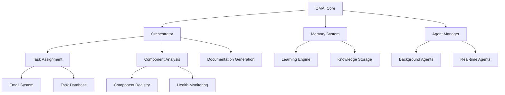

# OMAI Bible: The Complete Guide to Orthodox Metrics AI
*The Ultimate Reference for Orthodox Metrics Artificial Intelligence System*

**Version:** 2.0  
**Last Updated:** January 2025  
**Author:** System Analysis  
**Status:** Comprehensive Documentation  

---

## 📚 Table of Contents

1. [Executive Summary](#executive-summary)
2. [System Architecture](#system-architecture)
3. [Core Services](#core-services)
4. [API Reference](#api-reference)
5. [AI Agents](#ai-agents)
6. [Task Assignment System](#task-assignment-system)
7. [Learning & Memory System](#learning--memory-system)
8. [BigBook Integration](#bigbook-integration)
9. [Frontend Components](#frontend-components)
10. [Backend Services](#backend-services)
11. [Database Schema](#database-schema)
12. [Configuration](#configuration)
13. [Security & Authentication](#security--authentication)
14. [Deployment & Operations](#deployment--operations)
15. [Troubleshooting](#troubleshooting)
16. [Development Guide](#development-guide)
17. [API Endpoints Reference](#api-endpoints-reference)
18. [Code Examples](#code-examples)
19. [Integration Patterns](#integration-patterns)
20. [Performance & Monitoring](#performance--monitoring)

---

## 📋 Executive Summary

### What is OMAI?

**OMAI (Orthodox Metrics AI)** is the central intelligence system for the OrthodoxMetrics platform. It serves as the command center that provides AI-powered analysis, auto-fixing, intelligent assistance, and task management across all components of your Orthodox church management system.

### Core Mission
- **Intelligent Automation**: AI-powered component analysis and auto-fixing
- **System Orchestration**: Multi-agent coordination for complex tasks
- **Knowledge Management**: Continuous learning and documentation generation
- **Task Management**: Advanced AI task assignment and tracking system
- **Real-time Assistance**: Site-wide AI presence for administrators

### Key Capabilities
🧠 **Intelligence Features:**
- AI-powered component analysis and auto-fixing
- Intelligent code generation and documentation
- Real-time system monitoring and diagnostics
- Multi-agent orchestration for complex tasks
- Context-aware intelligent responses

🔧 **Agent Systems:**
- **Doc-Bot**: Automated documentation generation and validation
- **API Guardian**: API endpoint monitoring and validation
- **Schema Sentinel**: Database schema integrity checking
- **Refactor Agent**: Intelligent code improvement suggestions
- **Component Analyzer**: Frontend component health checks
- **Learning Engine**: Continuous knowledge ingestion and updates

📊 **Platform Integration:**
- Frontend component inspection and auto-repair
- Backend API route analysis
- Church records management optimization
- Multi-tenant system coordination
- BigBook knowledge system integration
- Email-based task assignment workflow

---

## 🏗️ System Architecture

### High-Level Architecture

```
OMAI System Architecture
├── Core Services
│   ├── orchestrator.js          # Main coordination engine
│   ├── index.js                 # Service entry point
│   ├── learningSources.js       # Learning configuration
│   └── memoryCore.js            # Knowledge storage system
│
├── Agent Systems
│   ├── omaiBackgroundService.js # Background processing
│   ├── omaiWatchdogService.js   # System monitoring
│   ├── omaiPathDiscovery.js     # Component discovery
│   └── agent-specific modules
│
├── API Layer
│   ├── /api/omai/*              # Core OMAI endpoints
│   ├── /api/globalOmai/*        # Site-wide AI assistance
│   └── /api/settings/email      # Email configuration
│
├── Frontend Components
│   ├── GlobalOMAI.tsx           # Site-wide AI assistant
│   ├── OMAITaskAssignmentWidget.tsx # Task management
│   ├── EmailSettingsForm.tsx    # Email configuration
│   └── Component integrations
│
├── Data Layer
│   ├── task_links               # Task assignment database
│   ├── task_submissions         # Task tracking
│   ├── email_settings           # SMTP configuration
│   └── omai_memories            # AI knowledge storage
│
└── External Integrations
    ├── Email Services (SMTP)    # Task assignment emails
    ├── Component Management     # System component control
    └── BigBook System           # Knowledge base
```

### Component Dependencies



---

## 🔧 Core Services

### 1. OMAI Main Service (`services/om-ai/`)

**Location**: `services/om-ai/index.js`  
**Purpose**: Core AI processing and orchestration  
**Type**: TypeScript service  

**Key Functions:**
- `askOMAI(prompt, context)` - Main AI query processing
- `askOMAIWithMetadata(prompt, metadata)` - Enhanced query with context
- `getOMAIHealth()` - System health checks
- `getOMAIStats()` - Performance statistics

### 2. Background Service (`server/services/omaiBackgroundService.js`)

**Purpose**: Continuous background processing  
**Management**: PM2 managed process (`omai-background`)  
**Features:**
- Automated component discovery
- Health monitoring
- Learning data ingestion
- Scheduled maintenance tasks

### 3. Orchestrator (`services/om-ai/orchestrator.js`)

**Purpose**: Multi-agent coordination and task management  
**Capabilities:**
- Agent lifecycle management
- Task queue processing
- Resource allocation
- Performance monitoring

### 4. Watchdog Service (`server/services/omaiWatchdogService.js`)

**Purpose**: System monitoring and auto-recovery  
**Features:**
- Service health monitoring
- Automatic restart on failure
- Performance metrics collection
- Alert generation

### 5. Path Discovery Service (`server/services/omaiPathDiscovery.js`)

**Purpose**: Dynamic component and route discovery  
**Capabilities:**
- Filesystem scanning
- Component registration
- Route mapping
- Dependency analysis

---

## 📡 API Reference

### Core OMAI Endpoints

#### 🏥 Health & Status

```http
GET /api/omai/status
```
**Purpose**: System status for frontend compatibility  
**Response**: 
```json
{
  "success": true,
  "status": "healthy",
  "version": "1.0.0",
  "uptime": 86400,
  "memory": {...},
  "activeAgents": ["omai-refactor", "omai-analyzer"],
  "components": {
    "orchestrator": "healthy",
    "scheduler": "healthy",
    "knowledgeEngine": "healthy"
  },
  "stats": {
    "totalRequests": 1250,
    "successfulRequests": 1200,
    "averageResponseTime": 245
  }
}
```

```http
GET /api/omai/health
```
**Purpose**: Detailed health check  

```http
GET /api/omai/stats
```
**Purpose**: Performance statistics  

#### 🧠 AI Query Processing

```http
POST /api/omai/ask
```
**Purpose**: Main AI query execution  
**Body**:
```json
{
  "prompt": "What is the system status?",
  "context": {
    "page": "/admin/dashboard",
    "user": "admin@example.com"
  }
}
```

```http
POST /api/omai/autofix
```
**Purpose**: Automated system fixing  

#### 🛠️ System Control

```http
POST /api/omai/control/start
```
**Purpose**: Start OMAI service  

```http
POST /api/omai/control/stop
```
**Purpose**: Stop OMAI service  

```http
POST /api/omai/control/restart
```
**Purpose**: Restart OMAI service  

```http
POST /api/omai/control/reload
```
**Purpose**: Reload OMAI configuration  

#### 📚 Memory Management

```http
GET /api/omai/memories
```
**Purpose**: Retrieve stored memories  
**Query Parameters**:
- `limit` - Number of memories to retrieve
- `category` - Memory category filter
- `search` - Search term

```http
POST /api/omai/consume
```
**Purpose**: Store memory for long-term learning  
**Body**:
```json
{
  "content": "System knowledge to store",
  "category": "troubleshooting",
  "source": "admin_interaction"
}
```

```http
DELETE /api/omai/memories/:id
```
**Purpose**: Delete specific memory  

#### 🤖 Agent Management

```http
POST /api/omai/run-agents
```
**Purpose**: Execute AI agents  

```http
GET /api/omai/agent-metrics
```
**Purpose**: Agent performance metrics  

```http
GET /api/omai/agent-results/:componentId
```
**Purpose**: Get agent results for specific component  

```http
POST /api/omai/agents/run-command
```
**Purpose**: Execute agent command  

#### 📝 Code Generation

```http
POST /api/omai/generate-doc
```
**Purpose**: Documentation generation  

```http
POST /api/omai/generate-module
```
**Purpose**: Code module generation  

#### 🔍 Learning System

```http
POST /api/omai/learn-now
```
**Purpose**: Manual trigger for immediate learning refresh  

```http
GET /api/omai/learning-status
```
**Purpose**: Get current learning status and statistics  

```http
POST /api/omai/upload-knowledge
```
**Purpose**: Upload knowledge file  

```http
POST /api/omai/ingest-agent-output
```
**Purpose**: Webhook for AI agent memory ingestion  

### Global OMAI Endpoints

#### 🌐 Site-wide AI Assistance

```http
POST /api/globalOmai/command
```
**Purpose**: Execute OMAI command site-wide  
**Body**:
```json
{
  "command": "analyze current page",
  "context": {
    "page": "/admin/users",
    "action": "page_analysis"
  }
}
```

---

## 📧 Task Assignment System

### Overview

The OMAI Task Assignment System enables OMAI to generate secure task assignment links tied to email addresses and send HTML forms that allow users to submit tasks directly to administrators.

### Architecture

```
Task Assignment Flow
├── Link Generation
│   ├── Email Input
│   ├── Secure Token (UUID)
│   ├── Database Storage
│   └── Email Delivery
│
├── Task Submission
│   ├── Token Validation
│   ├── Task Form (Dynamic)
│   ├── Multi-task Support
│   └── Email Notification
│
└── Management Interface
    ├── Admin Dashboard
    ├── Link Tracking
    ├── Submission Monitoring
    └── Status Updates
```

### Database Schema

#### task_links Table
```sql
CREATE TABLE task_links (
  id INT PRIMARY KEY AUTO_INCREMENT,
  email VARCHAR(255) NOT NULL,
  token VARCHAR(255) NOT NULL UNIQUE,
  created_at DATETIME NOT NULL DEFAULT CURRENT_TIMESTAMP,
  expires_at DATETIME DEFAULT DATE_ADD(CURRENT_TIMESTAMP, INTERVAL 30 DAY),
  is_used BOOLEAN DEFAULT FALSE,
  used_at DATETIME NULL,
  created_by_omai BOOLEAN DEFAULT TRUE
);
```

#### task_submissions Table
```sql
CREATE TABLE task_submissions (
  id INT PRIMARY KEY AUTO_INCREMENT,
  task_link_id INT NOT NULL,
  email VARCHAR(255) NOT NULL,
  tasks_json TEXT NOT NULL,
  submitted_at DATETIME NOT NULL DEFAULT CURRENT_TIMESTAMP,
  sent_to_nick BOOLEAN DEFAULT FALSE,
  sent_at DATETIME NULL,
  FOREIGN KEY (task_link_id) REFERENCES task_links(id) ON DELETE CASCADE
);
```

### API Endpoints

#### Task Link Management

```http
POST /api/omai/task-link
```
**Purpose**: Generate secure task assignment link  
**Body**:
```json
{
  "email": "user@example.com"
}
```
**Response**:
```json
{
  "id": 123,
  "email": "user@example.com",
  "url": "https://orthodoxmetrics.com/assign-task?token=uuid-here",
  "token": "abc123...",
  "created_at": "2025-01-30T12:00:00Z"
}
```

```http
GET /api/omai/validate-token
```
**Purpose**: Validate task assignment token  
**Query**: `?token=uuid-here`  

```http
DELETE /api/omai/task-link/:token
```
**Purpose**: Delete pending task link  

#### Task Submission

```http
POST /api/omai/submit-task
```
**Purpose**: Submit tasks from public form  
**Body**:
```json
{
  "token": "uuid-here",
  "tasks": [
    {
      "title": "Fix user login issue",
      "description": "Users cannot log in with new accounts",
      "priority": "high"
    }
  ]
}
```

#### Management & Monitoring

```http
GET /api/omai/task-logs
```
**Purpose**: Get recent task assignment activity  
**Query**: `?limit=10`  
**Response**:
```json
{
  "recent_links": [...],
  "recent_submissions": [...],
  "recent_logs": [...]
}
```

### Frontend Components

#### OMAI Task Assignment Widget

**Location**: `front-end/src/components/admin/OMAITaskAssignmentWidget.tsx`  
**Features**:
- Generate new task links
- Monitor link usage status
- View task submissions
- Download submission reports
- Delete unused links
- Copy task links
- Email settings configuration

#### Public Task Assignment Form

**Location**: `front-end/src/pages/AssignTaskPage.tsx`  
**Features**:
- Token validation
- Dynamic task form
- Multi-task support
- Priority selection
- Mobile responsive
- No authentication required

#### Email Settings Configuration

**Location**: `front-end/src/components/admin/EmailSettingsForm.tsx`  
**Features**:
- SMTP provider configuration
- Test email functionality
- Provider presets (GoDaddy, Outlook 365, Gmail, Yahoo)
- Security settings
- Sender information management

### Email Templates

#### Task Assignment Invitation
```html
<p>Hello,</p>
<p>You've been invited to assign tasks to Nick.</p>
<p>Click the link below to fill out your task form:</p>
<p><a href="https://orthodoxmetrics.com/assign-task?token=YOUR_TOKEN">Assign Tasks to Nick</a></p>
```

#### Task Submission Notification
```html
<h2>New Task Assignment from {email}</h2>
<p>Tasks submitted: {task_count}</p>
<ul>
  <li><strong>Task 1:</strong> {title} - Priority: {priority}</li>
  <!-- Additional tasks -->
</ul>
```

### Configuration

#### Email Settings Database

**Table**: `email_settings`  
**Purpose**: Store SMTP configuration for dynamic email sending  

```sql
CREATE TABLE email_settings (
    id INT PRIMARY KEY AUTO_INCREMENT,
    provider VARCHAR(50) NOT NULL DEFAULT 'Custom',
    smtp_host VARCHAR(255) NOT NULL,
    smtp_port INT NOT NULL DEFAULT 587,
    smtp_secure BOOLEAN NOT NULL DEFAULT FALSE,
    smtp_user VARCHAR(255) NOT NULL,
    smtp_pass VARCHAR(255) NOT NULL,
    sender_name VARCHAR(255) NOT NULL DEFAULT 'OMAI Task System',
    sender_email VARCHAR(255) NOT NULL,
    is_active BOOLEAN DEFAULT TRUE
);
```

#### Supported Email Providers

1. **GoDaddy**
   - Host: `smtpout.secureserver.net`
   - Port: 465 (SSL)
   - Setup: Use cPanel email with app password

2. **Outlook 365**
   - Host: `smtp-mail.outlook.com`
   - Port: 587 (STARTTLS)
   - Setup: Enable SMTP AUTH, use app password

3. **Gmail**
   - Host: `smtp.gmail.com`
   - Port: 587 (STARTTLS)
   - Setup: Use app password

4. **Yahoo**
   - Host: `smtp.mail.yahoo.com`
   - Port: 587 (STARTTLS)

5. **Custom Provider**
   - Configurable host, port, security settings

### Security Features

1. **Secure Token Generation**: UUIDv4 tokens
2. **Token Expiration**: 30-day automatic expiration
3. **One-time Use**: Links are marked as used after submission
4. **Input Sanitization**: All form inputs are sanitized
5. **Role-based Access**: Admin/super_admin access required
6. **Email Validation**: Proper email format validation
7. **CSRF Protection**: Included in form submissions

---

## 🤖 AI Agents

### Agent Architecture

OMAI employs a multi-agent system where specialized AI agents handle different aspects of system management and optimization.

### Core Agents

#### 1. Doc-Bot Agent
**Purpose**: Automated documentation generation and validation  
**Capabilities**:
- Generate API documentation
- Validate existing documentation
- Create user guides
- Update README files
- Generate changelog entries

**Agent Configuration**:
```javascript
{
  name: 'doc-bot',
  type: 'documentation',
  priority: 'medium',
  triggers: ['file_change', 'manual_request'],
  output_format: 'markdown'
}
```

#### 2. API Guardian Agent
**Purpose**: API endpoint monitoring and validation  
**Capabilities**:
- Monitor API response times
- Validate API schemas
- Detect breaking changes
- Generate API health reports
- Auto-fix common API issues

#### 3. Schema Sentinel Agent
**Purpose**: Database schema integrity checking  
**Capabilities**:
- Validate database schemas
- Detect schema drift
- Suggest optimizations
- Monitor foreign key constraints
- Generate migration scripts

#### 4. Refactor Agent
**Purpose**: Intelligent code improvement suggestions  
**Capabilities**:
- Analyze code quality
- Suggest refactoring opportunities
- Detect code smells
- Optimize performance bottlenecks
- Ensure coding standards compliance

#### 5. Component Analyzer Agent
**Purpose**: Frontend component health checks  
**Capabilities**:
- Analyze React component performance
- Detect accessibility issues
- Validate prop types
- Check for unused imports
- Monitor bundle size impact

#### 6. Learning Engine Agent
**Purpose**: Continuous knowledge ingestion and updates  
**Capabilities**:
- Process new documentation
- Extract knowledge from interactions
- Update knowledge base
- Generate insights
- Improve response accuracy

### Agent Execution

#### Manual Agent Execution
```http
POST /api/omai/run-agents
```
**Body**:
```json
{
  "agents": ["doc-bot", "api-guardian"],
  "context": {
    "component": "user-management",
    "priority": "high"
  }
}
```

#### Automated Agent Triggers
- **File System Changes**: Trigger relevant agents on code changes
- **Scheduled Execution**: Time-based agent execution
- **Health Threshold**: Execute agents when system health degrades
- **User Requests**: Manual agent invocation through UI

#### Agent Command Execution
```http
POST /api/omai/agents/run-command
```
**Body**:
```json
{
  "agent": "refactor-agent",
  "command": "analyze_component",
  "parameters": {
    "component_path": "/src/components/UserForm.tsx",
    "analysis_type": "performance"
  }
}
```

### Agent Results

#### Result Retrieval
```http
GET /api/omai/agent-results/:componentId
```
**Response**:
```json
{
  "agent": "component-analyzer",
  "component": "UserForm",
  "status": "completed",
  "findings": [
    {
      "type": "performance",
      "severity": "medium",
      "description": "Component re-renders unnecessarily",
      "suggestion": "Add React.memo() wrapper",
      "line": 45
    }
  ],
  "metrics": {
    "execution_time": "2.3s",
    "issues_found": 3,
    "confidence_score": 0.89
  }
}
```

#### Agent Metrics
```http
GET /api/omai/agent-metrics
```
**Response**:
```json
{
  "agents": [
    {
      "name": "doc-bot",
      "status": "active",
      "tasks_completed": 45,
      "success_rate": 0.95,
      "average_execution_time": "1.2s",
      "last_execution": "2025-01-30T10:30:00Z"
    }
  ]
}
```

---

## 🧠 Learning & Memory System

### Memory Architecture

```
Memory System Architecture
├── Memory Core
│   ├── Knowledge Storage
│   ├── Indexing Engine
│   ├── Retrieval System
│   └── Context Awareness
│
├── Learning Sources
│   ├── Documentation Files
│   ├── User Interactions
│   ├── System Logs
│   ├── Agent Outputs
│   └── External Knowledge
│
├── Processing Pipeline
│   ├── Content Ingestion
│   ├── Embeddings Generation
│   ├── Knowledge Extraction
│   ├── Context Classification
│   └── Storage Optimization
│
└── Retrieval Engine
    ├── Semantic Search
    ├── Context Matching
    ├── Relevance Scoring
    └── Response Generation
```

### Memory Management

#### Store Memory
```http
POST /api/omai/consume
```
**Purpose**: Store new knowledge for long-term learning  
**Body**:
```json
{
  "content": "User reported that the login button doesn't work on mobile Safari",
  "category": "bug_reports",
  "source": "user_interaction",
  "context": {
    "page": "/login",
    "browser": "Safari Mobile",
    "user_role": "user"
  },
  "priority": "high"
}
```

#### Retrieve Memories
```http
GET /api/omai/memories
```
**Query Parameters**:
- `limit` - Number of memories (default: 50)
- `category` - Filter by category
- `search` - Search term
- `since` - Date filter

**Response**:
```json
{
  "memories": [
    {
      "id": "mem_123",
      "content": "Login button fix applied for Safari mobile",
      "category": "bug_reports",
      "relevance_score": 0.95,
      "created_at": "2025-01-30T09:15:00Z",
      "context": {...}
    }
  ],
  "total": 156,
  "categories": ["bug_reports", "feature_requests", "documentation"]
}
```

#### Delete Memory
```http
DELETE /api/omai/memories/:id
```

### Learning System

#### Learning Status
```http
GET /api/omai/learning-status
```
**Response**:
```json
{
  "status": "active",
  "last_learning_session": "2025-01-30T08:00:00Z",
  "total_documents": 1250,
  "total_embeddings": 45000,
  "indexed_files": 890,
  "learning_sources": [
    {
      "source": "documentation",
      "files_processed": 340,
      "last_updated": "2025-01-30T07:30:00Z"
    }
  ],
  "memory_usage": {
    "embeddings_size": "2.4GB",
    "index_size": "850MB",
    "total_memories": 15600
  }
}
```

#### Manual Learning Trigger
```http
POST /api/omai/learn-now
```
**Purpose**: Trigger immediate learning refresh  
**Body**:
```json
{
  "sources": ["documentation", "user_interactions"],
  "force_reindex": false,
  "priority": "high"
}
```

#### Knowledge Upload
```http
POST /api/omai/upload-knowledge
```
**Purpose**: Upload knowledge files for processing  
**Content-Type**: `multipart/form-data`  
**Fields**:
- `file` - Knowledge file (PDF, TXT, MD)
- `category` - Knowledge category
- `priority` - Processing priority

### Learning Sources Configuration

**Location**: `services/om-ai/learningSources.js`  

```javascript
const learningSources = {
  documentation: {
    paths: ['docs/', 'README.md', '*.md'],
    priority: 'high',
    update_frequency: 'daily'
  },
  codebase: {
    paths: ['src/', 'server/'],
    exclude: ['node_modules/', '*.log'],
    priority: 'medium',
    update_frequency: 'hourly'
  },
  user_interactions: {
    sources: ['support_tickets', 'feedback', 'chat_logs'],
    priority: 'high',
    retention: '90 days'
  },
  system_logs: {
    paths: ['logs/'],
    priority: 'low',
    retention: '30 days'
  }
};
```

### Memory Categories

1. **System Knowledge**
   - API documentation
   - Configuration guides
   - Troubleshooting procedures
   - Architecture diagrams

2. **User Interactions**
   - Support requests
   - Bug reports
   - Feature requests
   - Usage patterns

3. **Code Knowledge**
   - Function documentation
   - Code comments
   - Algorithm explanations
   - Design patterns

4. **Operational Knowledge**
   - Deployment procedures
   - Monitoring data
   - Performance metrics
   - Error patterns

5. **Domain Knowledge**
   - Orthodox church practices
   - Business logic
   - Compliance requirements
   - Industry standards

---

## 📖 BigBook Integration

### Overview

OMAI integrates deeply with the BigBook system to provide comprehensive knowledge management and AI-powered content generation for Orthodox church documentation and procedures.

### BigBook-OMAI Bridge

**Location**: `front-end/src/components/bigbook/`  
**Purpose**: Seamless integration between OMAI AI and BigBook content system  

### Key Integration Points

#### 1. Content Analysis
- **AI Content Review**: OMAI analyzes BigBook content for accuracy
- **Consistency Checking**: Ensures theological and procedural consistency
- **Language Optimization**: Improves readability and clarity
- **Reference Validation**: Verifies citations and references

#### 2. Automated Content Generation
- **Documentation Templates**: AI-generated templates for common procedures
- **Content Suggestions**: OMAI suggests content improvements
- **Translation Support**: Multi-language content generation
- **Liturgical Calendar Integration**: Context-aware content based on church calendar

#### 3. Knowledge Extraction
- **Procedure Extraction**: OMAI extracts step-by-step procedures from BigBook
- **FAQ Generation**: Automatic generation of frequently asked questions
- **Search Enhancement**: AI-powered semantic search within BigBook
- **Content Categorization**: Automatic tagging and categorization

### BigBook-OMAI API Endpoints

#### Content Analysis
```http
POST /api/bigbook/analyze-content
```
**Body**:
```json
{
  "content_id": "liturgical_procedures_123",
  "analysis_type": "theological_accuracy",
  "context": "easter_preparation"
}
```

#### AI Content Generation
```http
POST /api/bigbook/generate-content
```
**Body**:
```json
{
  "template": "baptism_procedure",
  "context": {
    "church_tradition": "greek_orthodox",
    "language": "english"
  },
  "length": "detailed"
}
```

#### Knowledge Query
```http
POST /api/bigbook/query-knowledge
```
**Body**:
```json
{
  "query": "How to prepare for Pascha celebration?",
  "context": "parish_priest",
  "response_format": "step_by_step"
}
```

---

## 🖥️ Frontend Components

### Global OMAI Assistant

**Component**: `GlobalOMAI.tsx`  
**Location**: `front-end/src/components/global/GlobalOMAI.tsx`  
**Purpose**: Site-wide AI assistance for administrators  

#### Features
- **Floating AI Button**: Bottom-right corner FAB
- **Draggable Panel**: 400px wide, max 600px height
- **Context Awareness**: Knows current page and user context
- **Command Execution**: Execute OMAI commands directly
- **Page Analysis**: Analyze current page for improvements
- **Real-time Suggestions**: Contextual suggestions based on page content

#### Component Structure
```typescript
interface GlobalOMAIProps {
  userRole: string;
  currentPage: string;
  context?: Record<string, any>;
}

interface OMAIResponse {
  success: boolean;
  response: string;
  suggestions?: string[];
  actions?: OMAIAction[];
}
```

#### Usage Example
```jsx
import GlobalOMAI from '../components/global/GlobalOMAI';

// Automatically included in FullLayout.tsx
<GlobalOMAI 
  userRole={user.role}
  currentPage={location.pathname}
  context={{ 
    pageData: currentPageData,
    userPermissions: permissions 
  }}
/>
```

### OMAI Task Assignment Widget

**Component**: `OMAITaskAssignmentWidget.tsx`  
**Location**: `front-end/src/components/admin/OMAITaskAssignmentWidget.tsx`  
**Purpose**: Admin dashboard for task assignment management  

#### Features
- **Task Link Generation**: Create secure task assignment links
- **Link Management**: View, copy, and delete task links
- **Submission Monitoring**: Track task submissions and delivery status
- **Report Generation**: Download submission reports
- **Email Configuration**: Integrated SMTP settings
- **Activity Logging**: Monitor all task assignment activity

#### Component Tabs
1. **Links Tab**: Manage task assignment links
2. **Submissions Tab**: View and download task submissions
3. **Activity Tab**: Monitor system activity
4. **Settings Tab**: Email configuration and settings

### Component Registry Integration

**Location**: `front-end/src/components/registry/ComponentRegistry.tsx`  
**Purpose**: Dynamic component discovery and registration  

#### Features
- **Auto-discovery**: Automatic component detection
- **Status Monitoring**: Track component health and status
- **Dynamic Loading**: Load components based on system state
- **Menu Integration**: Hide disabled components from navigation

#### Integration with OMAI
```typescript
import { useFilteredMenuItems } from '../hooks/useFilteredMenuItems';

// Menu items automatically hide when components are disabled
const menuItems = useFilteredMenuItems();
```

---

## ⚙️ Backend Services

### Main OMAI Service

**Location**: `services/om-ai/`  
**Type**: TypeScript service  
**Purpose**: Core AI processing engine  

#### Service Structure
```
services/om-ai/
├── index.ts                 # Main service entry
├── orchestrator.ts          # Agent coordination
├── memoryCore.ts           # Knowledge management
├── agents/                 # Agent implementations
│   ├── docBot.ts
│   ├── apiGuardian.ts
│   └── componentAnalyzer.ts
├── types/                  # TypeScript definitions
└── utils/                  # Utility functions
```

#### Core Functions
```typescript
export async function askOMAI(prompt: string, context?: any): Promise<OMAIResponse>
export async function askOMAIWithMetadata(prompt: string, metadata: any): Promise<OMAIResponse>
export async function getOMAIHealth(): Promise<HealthStatus>
export async function getOMAIStats(): Promise<SystemStats>
```

### Background Service

**Location**: `server/services/omaiBackgroundService.js`  
**Management**: PM2 process (`omai-background`)  
**Purpose**: Continuous background processing  

#### Responsibilities
- **Component Discovery**: Scan for new components
- **Health Monitoring**: Monitor system health metrics
- **Learning Pipeline**: Process new knowledge continuously
- **Maintenance Tasks**: Cleanup and optimization
- **Alert Generation**: Generate system alerts

#### Configuration
```javascript
const backgroundConfig = {
  discovery_interval: '5m',
  health_check_interval: '1m',
  learning_interval: '15m',
  maintenance_interval: '1h',
  max_memory_usage: '2GB'
};
```

### Watchdog Service

**Location**: `server/services/omaiWatchdogService.js`  
**Purpose**: Service monitoring and auto-recovery  

#### Features
- **Process Monitoring**: Monitor OMAI processes
- **Auto-restart**: Restart failed services
- **Performance Tracking**: Track service performance
- **Resource Management**: Monitor resource usage
- **Alert System**: Generate alerts for issues

### Path Discovery Service

**Location**: `server/services/omaiPathDiscovery.js`  
**Purpose**: Dynamic system discovery  

#### Capabilities
- **Component Scanning**: Discover React components
- **Route Discovery**: Map API routes
- **Dependency Analysis**: Analyze component dependencies
- **Change Detection**: Detect filesystem changes
- **Registration**: Register components in system

### Email Service Integration

**Location**: `server/utils/emailService.js`  
**Purpose**: Dynamic email configuration and sending  

#### Features
- **SMTP Configuration**: Dynamic SMTP settings from database
- **Provider Support**: Multiple email provider support
- **Template System**: HTML email templates
- **Fallback System**: Graceful fallback to environment variables
- **Testing**: Built-in email testing functionality

#### Email Service Functions
```javascript
// Dynamic SMTP configuration
const createTransporter = async () => {
  const dbConfig = await getActiveEmailConfig();
  // Use database config or fallback to env vars
}

// Task assignment emails
const sendTaskAssignmentEmail = async (email, taskURL, token)
const sendTaskSubmissionEmail = async (fromEmail, tasks, submissionId)
```

---

## 🗄️ Database Schema

### OMAI Core Tables

#### omai_memories
```sql
CREATE TABLE omai_memories (
  id INT PRIMARY KEY AUTO_INCREMENT,
  content TEXT NOT NULL,
  category VARCHAR(100),
  source VARCHAR(100),
  context JSON,
  embeddings BLOB,
  relevance_score FLOAT,
  created_at TIMESTAMP DEFAULT CURRENT_TIMESTAMP,
  updated_at TIMESTAMP DEFAULT CURRENT_TIMESTAMP ON UPDATE CURRENT_TIMESTAMP,
  INDEX idx_category (category),
  INDEX idx_source (source),
  INDEX idx_created_at (created_at)
);
```

#### omai_learning_sessions
```sql
CREATE TABLE omai_learning_sessions (
  id INT PRIMARY KEY AUTO_INCREMENT,
  session_type VARCHAR(50),
  source_paths JSON,
  files_processed INT DEFAULT 0,
  embeddings_generated INT DEFAULT 0,
  status ENUM('running', 'completed', 'failed'),
  started_at TIMESTAMP DEFAULT CURRENT_TIMESTAMP,
  completed_at TIMESTAMP NULL,
  error_message TEXT,
  metadata JSON
);
```

#### omai_agent_executions
```sql
CREATE TABLE omai_agent_executions (
  id INT PRIMARY KEY AUTO_INCREMENT,
  agent_name VARCHAR(100) NOT NULL,
  component_target VARCHAR(255),
  execution_type VARCHAR(50),
  status ENUM('pending', 'running', 'completed', 'failed'),
  input_parameters JSON,
  output_results JSON,
  execution_time_ms INT,
  started_at TIMESTAMP DEFAULT CURRENT_TIMESTAMP,
  completed_at TIMESTAMP NULL,
  error_message TEXT
);
```

### Task Assignment Tables

#### task_links
```sql
CREATE TABLE task_links (
  id INT PRIMARY KEY AUTO_INCREMENT,
  email VARCHAR(255) NOT NULL,
  token VARCHAR(255) NOT NULL UNIQUE,
  created_at DATETIME NOT NULL DEFAULT CURRENT_TIMESTAMP,
  expires_at DATETIME DEFAULT DATE_ADD(CURRENT_TIMESTAMP, INTERVAL 30 DAY),
  is_used BOOLEAN DEFAULT FALSE,
  used_at DATETIME NULL,
  created_by_omai BOOLEAN DEFAULT TRUE,
  INDEX idx_token (token),
  INDEX idx_email (email),
  INDEX idx_created_at (created_at)
);
```

#### task_submissions
```sql
CREATE TABLE task_submissions (
  id INT PRIMARY KEY AUTO_INCREMENT,
  task_link_id INT NOT NULL,
  email VARCHAR(255) NOT NULL,
  tasks_json TEXT NOT NULL,
  submitted_at DATETIME NOT NULL DEFAULT CURRENT_TIMESTAMP,
  sent_to_nick BOOLEAN DEFAULT FALSE,
  sent_at DATETIME NULL,
  FOREIGN KEY (task_link_id) REFERENCES task_links(id) ON DELETE CASCADE,
  INDEX idx_task_link_id (task_link_id),
  INDEX idx_submitted_at (submitted_at)
);
```

### Configuration Tables

#### email_settings
```sql
CREATE TABLE email_settings (
  id INT PRIMARY KEY AUTO_INCREMENT,
  provider VARCHAR(50) NOT NULL DEFAULT 'Custom',
  smtp_host VARCHAR(255) NOT NULL,
  smtp_port INT NOT NULL DEFAULT 587,
  smtp_secure BOOLEAN NOT NULL DEFAULT FALSE,
  smtp_user VARCHAR(255) NOT NULL,
  smtp_pass VARCHAR(255) NOT NULL,
  sender_name VARCHAR(255) NOT NULL DEFAULT 'OMAI Task System',
  sender_email VARCHAR(255) NOT NULL,
  is_active BOOLEAN DEFAULT TRUE,
  created_at DATETIME NOT NULL DEFAULT CURRENT_TIMESTAMP,
  updated_at DATETIME NOT NULL DEFAULT CURRENT_TIMESTAMP ON UPDATE CURRENT_TIMESTAMP
);
```

---

## ⚙️ Configuration

### Environment Variables

#### Core OMAI Settings
```bash
# OMAI Service Configuration
OMAI_SERVICE_URL=http://localhost:3001
OMAI_API_KEY=your_api_key_here
OMAI_LOG_LEVEL=info
OMAI_MAX_MEMORY=4GB

# AI Configuration
OPENAI_API_KEY=sk-...
ANTHROPIC_API_KEY=ant-...
GOOGLE_AI_API_KEY=...

# Learning System
OMAI_LEARNING_INTERVAL=15
OMAI_MAX_EMBEDDINGS=50000
OMAI_KNOWLEDGE_RETENTION_DAYS=365

# Background Service
OMAI_BACKGROUND_ENABLED=true
OMAI_DISCOVERY_INTERVAL=300
OMAI_HEALTH_CHECK_INTERVAL=60
```

#### Email Configuration
```bash
# Default SMTP (Fallback)
SMTP_HOST=smtp.gmail.com
SMTP_PORT=587
SMTP_SECURE=false
SMTP_USER=your-email@gmail.com
SMTP_PASS=your-app-password

# Email Service
EMAIL_FROM_NAME=OMAI Task System
EMAIL_FROM_ADDRESS=noreply@orthodoxmetrics.com
```

### Configuration Files

#### OMAI Commands Configuration
**Location**: `omai-commands.json`
```json
{
  "commands": {
    "analyze_page": {
      "description": "Analyze current page for improvements",
      "requires_context": true,
      "output_format": "markdown"
    },
    "fix_component": {
      "description": "Auto-fix component issues",
      "requires_admin": true,
      "agents": ["component-analyzer", "refactor-agent"]
    },
    "generate_docs": {
      "description": "Generate documentation",
      "agents": ["doc-bot"],
      "output_path": "docs/"
    }
  }
}
```

#### Learning Sources Configuration
**Location**: `services/om-ai/learningSources.js`
```javascript
module.exports = {
  documentation: {
    enabled: true,
    paths: ['docs/**/*.md', 'README.md'],
    priority: 'high',
    update_frequency: 'daily'
  },
  codebase: {
    enabled: true,
    paths: ['src/**/*.{ts,tsx,js,jsx}', 'server/**/*.js'],
    exclude: ['node_modules/**', '*.test.*'],
    priority: 'medium'
  },
  user_interactions: {
    enabled: true,
    sources: ['task_submissions', 'support_requests'],
    retention_days: 90
  }
};
```

### PM2 Configuration

#### OMAI Processes
**Location**: `ecosystem.config.js`
```javascript
module.exports = {
  apps: [
    {
      name: 'orthodox-backend',
      script: './index.js',
      cwd: './server',
      env: {
        NODE_ENV: 'production',
        PORT: 3001
      }
    },
    {
      name: 'omai-background',
      script: './services/omaiBackgroundService.js',
      cwd: './server',
      env: {
        NODE_ENV: 'production',
        OMAI_MODE: 'background'
      },
      max_memory_restart: '2G',
      cron_restart: '0 2 * * *'
    }
  ]
};
```

---

## 🔐 Security & Authentication

### Authentication Requirements

#### Admin Access
- **OMAI Core**: Requires `super_admin` role
- **Task Assignment**: Requires `admin` or `super_admin` role
- **Global OMAI**: Requires `super_admin` role
- **Email Settings**: Requires `admin` or `super_admin` role

#### Public Access
- **Task Submission Form**: No authentication (token-based)
- **Token Validation**: Public endpoint with token verification

### Security Measures

#### 1. Token Security
```javascript
// Secure token generation
const generateSecureToken = () => {
  return require('uuid').v4();
};

// Token validation
const validateToken = async (token) => {
  const link = await db.query('SELECT * FROM task_links WHERE token = ? AND expires_at > NOW()', [token]);
  return link.length > 0 && !link[0].is_used;
};
```

#### 2. Input Sanitization
```javascript
const sanitizeTasks = (tasks) => {
  return tasks.map(task => ({
    title: sanitizeString(task.title, 200),
    description: sanitizeString(task.description, 1000),
    priority: validatePriority(task.priority)
  }));
};
```

#### 3. Rate Limiting
```javascript
// Task link generation rate limiting
const rateLimiter = rateLimit({
  windowMs: 15 * 60 * 1000, // 15 minutes
  max: 5, // 5 task links per IP per window
  message: 'Too many task links generated, please try again later'
});
```

#### 4. CSRF Protection
```javascript
// CSRF tokens for task submission
app.use(csrf({
  cookie: true,
  ignoreMethods: ['GET', 'HEAD', 'OPTIONS']
}));
```

#### 5. Email Security
- **Password Protection**: SMTP passwords encrypted in database
- **Domain Validation**: Sender domain validation
- **Rate Limiting**: Email sending rate limits
- **Bounce Handling**: Email bounce detection and handling

### Security Headers

```javascript
// Security headers for OMAI endpoints
app.use('/api/omai/', (req, res, next) => {
  res.setHeader('X-Content-Type-Options', 'nosniff');
  res.setHeader('X-Frame-Options', 'DENY');
  res.setHeader('X-XSS-Protection', '1; mode=block');
  res.setHeader('Strict-Transport-Security', 'max-age=31536000');
  next();
});
```

---

## 🚀 Deployment & Operations

### Service Management

#### PM2 Commands
```bash
# Start OMAI services
pm2 start ecosystem.config.js

# Monitor OMAI processes
pm2 monit

# View OMAI logs
pm2 logs omai-background

# Restart OMAI background service
pm2 restart omai-background

# Stop OMAI services
pm2 stop omai-background

# Reload OMAI with zero downtime
pm2 reload omai-background
```

#### Service Health Checks
```bash
# Check OMAI status
curl http://localhost:3001/api/omai/status

# Check service health
curl http://localhost:3001/api/omai/health

# Get service statistics
curl http://localhost:3001/api/omai/stats
```

### Database Migrations

#### OMAI Tables Migration
```bash
# Run OMAI database migrations
mysql -u root -p orthodoxmetrics_db < server/database/migrations/create_email_settings_table.sql
mysql -u root -p orthodoxmetrics_db < database/migrations/create_omai_task_links_table.sql
```

#### Verify Tables
```sql
-- Verify OMAI tables exist
SHOW TABLES LIKE '%omai%';
SHOW TABLES LIKE '%task_%';
SHOW TABLES LIKE 'email_settings';
```

### Backup & Recovery

#### Database Backup
```bash
# Backup OMAI-related tables
mysqldump -u root -p orthodoxmetrics_db \
  task_links task_submissions email_settings \
  omai_memories omai_learning_sessions \
  > omai_backup_$(date +%Y%m%d).sql
```

#### Knowledge Base Backup
```bash
# Backup OMAI knowledge and embeddings
tar -czf omai_knowledge_backup_$(date +%Y%m%d).tar.gz \
  services/om-ai/knowledge/ \
  services/om-ai/embeddings/ \
  docs/
```

### Monitoring & Alerting

#### Key Metrics
- **Service Uptime**: OMAI service availability
- **Response Times**: API endpoint performance
- **Memory Usage**: AI model memory consumption
- **Task Processing**: Task assignment completion rates
- **Learning Status**: Knowledge ingestion progress
- **Agent Performance**: AI agent execution metrics

#### Monitoring Endpoints
```bash
# Service metrics
curl http://localhost:3001/api/omai/agent-metrics

# Learning status
curl http://localhost:3001/api/omai/learning-status

# Memory usage
curl http://localhost:3001/api/omai/memory-stats
```

---

## 🔧 Troubleshooting

### Common Issues

#### 1. OMAI Service Not Starting
**Symptoms**: 500 errors on `/api/omai/status`
**Diagnosis**:
```bash
# Check PM2 status
pm2 status

# Check logs
pm2 logs omai-background --lines 50

# Check service health
curl http://localhost:3001/api/omai/health
```
**Solutions**:
- Restart background service: `pm2 restart omai-background`
- Check memory usage: `pm2 monit`
- Verify configuration files exist
- Check database connectivity

#### 2. Task Assignment Emails Not Sending
**Symptoms**: Task links generated but emails not received
**Diagnosis**:
```bash
# Test email configuration
curl -X POST http://localhost:3001/api/settings/email/test \
  -H "Content-Type: application/json" \
  -d '{"test_email": "test@example.com"}'

# Check email settings
curl http://localhost:3001/api/settings/email
```
**Solutions**:
- Verify SMTP credentials in database
- Check email provider settings
- Test with different email provider
- Check firewall/network restrictions

#### 3. High Memory Usage
**Symptoms**: OMAI service restarting frequently
**Diagnosis**:
```bash
# Check memory usage
pm2 monit

# Check learning session status
curl http://localhost:3001/api/omai/learning-status
```
**Solutions**:
- Reduce embedding batch size
- Clear old memories: `DELETE FROM omai_memories WHERE created_at < DATE_SUB(NOW(), INTERVAL 90 DAY)`
- Increase PM2 memory limit
- Optimize learning sources

#### 4. Slow Response Times
**Symptoms**: OMAI queries taking > 5 seconds
**Diagnosis**:
```bash
# Check agent performance
curl http://localhost:3001/api/omai/agent-metrics

# Monitor API response times
time curl http://localhost:3001/api/omai/ask \
  -X POST -d '{"prompt": "test"}'
```
**Solutions**:
- Optimize agent execution
- Reduce context size
- Cache frequent queries
- Scale OMAI service horizontally

### Debug Commands

#### Service Debug
```bash
# Enable debug logging
export OMAI_LOG_LEVEL=debug
pm2 restart omai-background

# View detailed logs
pm2 logs omai-background --lines 100

# Check service configuration
node -e "console.log(require('./services/om-ai/learningSources.js'))"
```

#### Database Debug
```sql
-- Check task assignment activity
SELECT COUNT(*) as total_links, 
       SUM(is_used) as used_links,
       AVG(TIMESTAMPDIFF(HOUR, created_at, used_at)) as avg_usage_hours
FROM task_links 
WHERE created_at > DATE_SUB(NOW(), INTERVAL 7 DAY);

-- Check email settings
SELECT provider, smtp_host, smtp_port, sender_email, is_active 
FROM email_settings 
WHERE is_active = TRUE;

-- Check memory usage
SELECT category, COUNT(*) as memories, 
       AVG(LENGTH(content)) as avg_content_length
FROM omai_memories 
GROUP BY category;
```

#### API Debug
```bash
# Test all OMAI endpoints
curl http://localhost:3001/api/omai/status
curl http://localhost:3001/api/omai/health
curl http://localhost:3001/api/omai/stats
curl http://localhost:3001/api/omai/learning-status

# Test task assignment flow
curl -X POST http://localhost:3001/api/omai/task-link \
  -H "Content-Type: application/json" \
  -d '{"email": "test@example.com"}'
```

---

## 👨‍💻 Development Guide

### Setting Up Development Environment

#### Prerequisites
```bash
# Install dependencies
npm install

# Environment setup
cp .env.example .env
# Edit .env with your configuration

# Database setup
mysql -u root -p orthodoxmetrics_db < server/database/migrations/create_email_settings_table.sql
mysql -u root -p orthodoxmetrics_db < database/migrations/create_omai_task_links_table.sql
```

#### Development Scripts
```bash
# Start development server
npm run dev

# Start OMAI background service in development
NODE_ENV=development pm2 start server/services/omaiBackgroundService.js --name omai-dev

# Run OMAI tests
npm run test:omai

# Generate component manifest
npm run generate-manifest
```

### Creating New Agents

#### Agent Template
```typescript
// services/om-ai/agents/myAgent.ts
export class MyAgent {
  name = 'my-agent';
  description = 'Description of agent functionality';
  version = '1.0.0';

  async execute(context: AgentContext): Promise<AgentResult> {
    try {
      // Agent logic here
      return {
        success: true,
        data: result,
        metrics: {
          execution_time: Date.now() - startTime,
          items_processed: count
        }
      };
    } catch (error) {
      return {
        success: false,
        error: error.message
      };
    }
  }

  async validateInput(input: any): Promise<boolean> {
    // Input validation logic
    return true;
  }
}
```

#### Register Agent
```typescript
// services/om-ai/orchestrator.ts
import { MyAgent } from './agents/myAgent';

export class OMAIOrchestrator {
  private agents = new Map([
    ['my-agent', new MyAgent()],
    // ... other agents
  ]);
}
```

### Adding New OMAI Endpoints

#### Backend Route
```javascript
// server/routes/omai.js
router.post('/my-endpoint', async (req, res) => {
  try {
    const { parameter1, parameter2 } = req.body;
    
    // Validate input
    if (!parameter1) {
      return res.status(400).json({
        success: false,
        error: 'parameter1 is required'
      });
    }

    // Process request
    const result = await myOMAIFunction(parameter1, parameter2);

    res.json({
      success: true,
      data: result
    });
  } catch (error) {
    console.error('OMAI endpoint error:', error);
    res.status(500).json({
      success: false,
      error: error.message
    });
  }
});
```

#### Frontend Integration
```typescript
// front-end/src/api/omai.api.ts
class OMAIAPI {
  myEndpoint = (param1: string, param2?: string): Promise<MyResponse> =>
    apiClient.post('/omai/my-endpoint', { param1, param2 });
}
```

### Testing OMAI Features

#### Unit Tests
```javascript
// tests/omai/agent.test.js
const { MyAgent } = require('../services/om-ai/agents/myAgent');

describe('MyAgent', () => {
  let agent;

  beforeEach(() => {
    agent = new MyAgent();
  });

  test('should execute successfully', async () => {
    const context = { test: 'data' };
    const result = await agent.execute(context);
    
    expect(result.success).toBe(true);
    expect(result.data).toBeDefined();
  });
});
```

#### Integration Tests
```javascript
// tests/omai/api.test.js
const request = require('supertest');
const app = require('../server/index');

describe('OMAI API', () => {
  test('GET /api/omai/status', async () => {
    const response = await request(app)
      .get('/api/omai/status')
      .expect(200);

    expect(response.body.success).toBe(true);
    expect(response.body.status).toBe('healthy');
  });
});
```

### Contributing Guidelines

#### Code Style
- Use TypeScript for new OMAI services
- Follow existing naming conventions
- Add comprehensive error handling
- Include JSDoc comments for functions
- Write unit tests for new features

#### Documentation
- Update this OMAI Bible for new features
- Add API documentation for new endpoints
- Include usage examples
- Document configuration options

#### Pull Request Process
1. Create feature branch: `git checkout -b feature/omai-new-feature`
2. Implement feature with tests
3. Update documentation
4. Submit pull request with detailed description
5. Ensure all tests pass
6. Request review from OMAI maintainers

---

## 📊 Performance & Monitoring

### Key Performance Indicators

#### Service Metrics
- **Uptime**: Target 99.9% availability
- **Response Time**: < 2 seconds for 95% of requests
- **Memory Usage**: < 2GB for background service
- **CPU Usage**: < 50% average
- **Error Rate**: < 1% of total requests

#### Task Assignment Metrics
- **Link Generation**: < 500ms response time
- **Email Delivery**: < 30 seconds
- **Form Submission**: < 1 second processing
- **Token Validation**: < 100ms

#### Learning System Metrics
- **Knowledge Ingestion**: Process 100+ documents/hour
- **Embedding Generation**: < 10ms per embedding
- **Memory Retrieval**: < 200ms for semantic search
- **Learning Sessions**: Complete within 15 minutes

### Monitoring Dashboards

#### System Health Dashboard
```javascript
// Dashboard metrics endpoint
GET /api/omai/dashboard-metrics

{
  "system_health": {
    "status": "healthy",
    "uptime": "15d 4h 32m",
    "memory_usage": "1.2GB / 2GB",
    "cpu_usage": "34%"
  },
  "request_metrics": {
    "total_requests_24h": 1250,
    "average_response_time": "245ms",
    "error_rate": "0.3%"
  },
  "task_assignment": {
    "active_links": 5,
    "submissions_24h": 8,
    "email_delivery_rate": "100%"
  },
  "learning_system": {
    "total_memories": 15600,
    "last_learning_session": "2025-01-30T08:00:00Z",
    "knowledge_sources": 4
  }
}
```

#### Agent Performance Dashboard
```javascript
// Agent metrics endpoint
GET /api/omai/agent-metrics

{
  "agents": [
    {
      "name": "doc-bot",
      "status": "active",
      "tasks_completed_24h": 12,
      "success_rate": "95%",
      "average_execution_time": "1.2s",
      "last_execution": "2025-01-30T10:30:00Z"
    }
  ],
  "queue_status": {
    "pending_tasks": 3,
    "processing_tasks": 1,
    "completed_tasks_24h": 45
  }
}
```

### Performance Optimization

#### Database Optimization
```sql
-- Index optimization for OMAI tables
CREATE INDEX idx_omai_memories_category_created ON omai_memories(category, created_at);
CREATE INDEX idx_task_links_email_created ON task_links(email, created_at);
CREATE INDEX idx_agent_executions_agent_status ON omai_agent_executions(agent_name, status);

-- Memory cleanup
DELETE FROM omai_memories WHERE created_at < DATE_SUB(NOW(), INTERVAL 365 DAY);
DELETE FROM omai_learning_sessions WHERE completed_at < DATE_SUB(NOW(), INTERVAL 90 DAY);
```

#### Caching Strategy
```javascript
// Redis caching for OMAI responses
const redis = require('redis');
const client = redis.createClient();

// Cache frequent queries
const cacheKey = `omai:query:${hashQuery(prompt)}`;
const cached = await client.get(cacheKey);
if (cached) {
  return JSON.parse(cached);
}

// Cache result for 1 hour
await client.setex(cacheKey, 3600, JSON.stringify(result));
```

#### Memory Management
```javascript
// Memory optimization for embeddings
const memoryConfig = {
  max_embeddings_in_memory: 10000,
  embedding_cache_ttl: 3600,
  batch_size: 100,
  gc_threshold: 0.8
};

// Automatic garbage collection
if (process.memoryUsage().heapUsed / process.memoryUsage().heapTotal > memoryConfig.gc_threshold) {
  global.gc();
}
```

---

## 🔗 Integration Patterns

### Component Integration

#### Menu System Integration
```typescript
// Automatically hide disabled components from menu
const useFilteredMenuItems = () => {
  const [componentStatus, setComponentStatus] = useState({});
  
  useEffect(() => {
    // Fetch component status from OMAI
    componentsAPI.getAll().then(response => {
      const statusMap = {};
      response.components.forEach(component => {
        statusMap[component.name] = component.enabled;
      });
      setComponentStatus(statusMap);
    });
  }, []);

  const isComponentEnabled = (menuTitle) => {
    return componentStatus[menuTitle] !== false;
  };

  // Filter menu items based on component status
  return menuItems.filter(item => isComponentEnabled(item.title));
};
```

#### Health Monitoring Integration
```javascript
// Automatic health detection for components
const getComponentHealthStatus = (logs) => {
  const recentLogs = logs.filter(log => 
    new Date(log.timestamp) > new Date(Date.now() - 24 * 60 * 60 * 1000)
  );

  for (const rule of HEALTH_DETECTION_RULES) {
    const matchingLogs = recentLogs.filter(log =>
      rule.level.includes(log.level) && 
      rule.pattern.test(log.message)
    );
    
    if (matchingLogs.length > 0) {
      return rule.severity;
    }
  }

  return 'healthy';
};
```

### External Service Integration

#### Email Provider Integration
```javascript
// Dynamic SMTP provider configuration
const getEmailConfig = async () => {
  const dbConfig = await getActiveEmailConfig();
  
  if (dbConfig) {
    return {
      host: dbConfig.smtp_host,
      port: dbConfig.smtp_port,
      secure: dbConfig.smtp_secure,
      auth: {
        user: dbConfig.smtp_user,
        pass: dbConfig.smtp_pass
      }
    };
  }
  
  // Fallback to environment variables
  return {
    host: process.env.SMTP_HOST,
    port: process.env.SMTP_PORT,
    secure: process.env.SMTP_SECURE === 'true',
    auth: {
      user: process.env.SMTP_USER,
      pass: process.env.SMTP_PASS
    }
  };
};
```

#### BigBook Knowledge Integration
```javascript
// OMAI-BigBook knowledge bridge
const searchBigBookKnowledge = async (query, context) => {
  // Search BigBook content with OMAI semantic understanding
  const bigBookResults = await bigBookAPI.search(query);
  
  // Enhance results with OMAI context analysis
  const enhancedResults = await Promise.all(
    bigBookResults.map(async result => {
      const analysis = await askOMAI(
        `Analyze this Orthodox content for relevance to: ${query}`,
        { content: result.content, context }
      );
      
      return {
        ...result,
        relevance_score: analysis.relevance_score,
        omai_summary: analysis.summary
      };
    })
  );
  
  return enhancedResults.sort((a, b) => b.relevance_score - a.relevance_score);
};
```

---

## 📚 Code Examples

### Complete Task Assignment Flow

```javascript
// Backend: Generate task link
app.post('/api/omai/task-link', async (req, res) => {
  const { email } = req.body;
  
  // Generate secure token
  const token = generateSecureToken();
  
  // Store in database
  const [result] = await db.execute(
    'INSERT INTO task_links (email, token) VALUES (?, ?)',
    [email, token]
  );
  
  // Generate task URL
  const taskURL = `${process.env.FRONTEND_URL}/assign-task?token=${token}`;
  
  // Send email
  await sendTaskAssignmentEmail(email, taskURL, token);
  
  res.json({
    id: result.insertId,
    email,
    url: taskURL,
    token: token.substring(0, 8) + '...',
    created_at: new Date().toISOString()
  });
});

// Frontend: Task submission form
const AssignTaskPage = () => {
  const [token] = useSearchParams();
  const [tasks, setTasks] = useState([{ title: '', description: '', priority: 'medium' }]);
  
  const handleSubmit = async () => {
    const response = await omaiAPI.submitTasks(token, tasks);
    if (response.success) {
      setSuccess('Tasks submitted successfully!');
    }
  };
  
  return (
    <form onSubmit={handleSubmit}>
      {tasks.map((task, index) => (
        <TaskInput 
          key={index}
          task={task}
          onChange={(updatedTask) => updateTask(index, updatedTask)}
        />
      ))}
      <button type="submit">Submit Tasks</button>
    </form>
  );
};
```

### OMAI Agent Implementation

```typescript
// Complete agent implementation
export class DocumentationAgent {
  name = 'doc-bot';
  version = '1.0.0';
  
  async execute(context: AgentContext): Promise<AgentResult> {
    const startTime = Date.now();
    
    try {
      // Validate input
      if (!await this.validateContext(context)) {
        throw new Error('Invalid context provided');
      }
      
      // Execute documentation analysis
      const analysis = await this.analyzeDocumentation(context.filePath);
      
      // Generate improvements
      const improvements = await this.generateImprovements(analysis);
      
      // Apply improvements if requested
      if (context.autoApply) {
        await this.applyImprovements(context.filePath, improvements);
      }
      
      return {
        success: true,
        data: {
          analysis,
          improvements,
          applied: context.autoApply
        },
        metrics: {
          execution_time: Date.now() - startTime,
          files_analyzed: 1,
          improvements_found: improvements.length
        }
      };
    } catch (error) {
      return {
        success: false,
        error: error.message,
        metrics: {
          execution_time: Date.now() - startTime
        }
      };
    }
  }
  
  private async analyzeDocumentation(filePath: string) {
    const content = await fs.readFile(filePath, 'utf8');
    
    // Use OMAI to analyze content
    const analysis = await askOMAI(
      'Analyze this documentation for completeness and clarity',
      { content, filePath }
    );
    
    return analysis;
  }
  
  private async generateImprovements(analysis: any) {
    // Generate specific improvements based on analysis
    return analysis.suggestions.map(suggestion => ({
      type: suggestion.type,
      description: suggestion.description,
      line: suggestion.line,
      severity: suggestion.severity
    }));
  }
}
```

---

## 🎯 Conclusion

The OMAI (Orthodox Metrics AI) system represents a comprehensive artificial intelligence solution integrated throughout the Orthodox Metrics platform. This documentation covers every aspect of OMAI, from basic usage to advanced development patterns.

### Key Takeaways

1. **Comprehensive AI Integration**: OMAI is not just an add-on but a core part of the platform architecture
2. **Multi-Agent System**: Specialized agents handle different aspects of system management
3. **Task Assignment Workflow**: Complete email-based task assignment system with secure token management
4. **Learning & Memory**: Continuous learning system that improves over time
5. **Frontend Integration**: Seamless integration with React components and menu systems
6. **Security First**: Comprehensive security measures for all OMAI functionality
7. **Performance Optimized**: Built for production use with monitoring and optimization

### Next Steps

1. **Explore Specific Features**: Use this documentation to understand specific OMAI features
2. **Development**: Follow the development guide to extend OMAI functionality
3. **Monitoring**: Implement the monitoring patterns for production deployment
4. **Customization**: Adapt OMAI components for your specific church management needs

For questions, issues, or contributions, refer to the troubleshooting section or contact the development team.

---

*This OMAI Bible is a living document. As OMAI evolves, this documentation will be updated to reflect new features and capabilities.* 